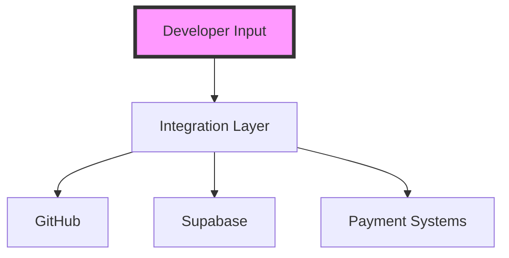
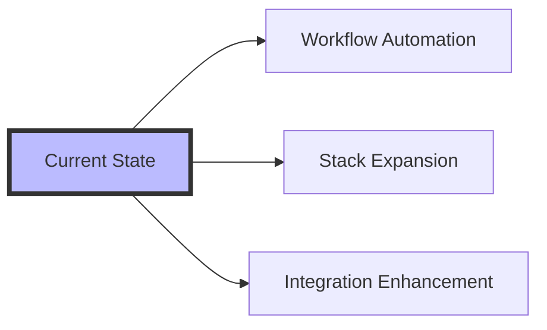

>[!info A systematic examination of Lovable's emergent position in the AI-powered development landscape, analyzing its distinct advantages over competitors like Bolt and Cursor through the lens of integrated systems thinking.]


## Introduction: The Evolution of AI-Powered Development

In the rapidly evolving landscape of software development tools, **Lovable** has emerged as a transformative platform that fundamentally reimagines how developers interact with AI systems. Unlike traditional development environments, Lovable represents a *cognitive leap* in how we approach code creation and system architecture.

> **AI-Augmented Development**: A paradigm where artificial intelligence extends human cognitive capabilities in software creation, transforming the relationship between developer intent and code manifestation.

## Intelligent Prompting: The Cognitive Foundation

At the heart of Lovable's innovative approach lies its sophisticated prompt interpretation system, which demonstrates remarkable capabilities in understanding and executing developer intentions:

### System Intelligence Matrix

| Capability | Implementation | Developer Impact |
|------------|----------------|------------------|
| **Requirement Analysis** | Neural processing of natural language | Comprehensive code solutions |
| **Context Awareness** | Historical pattern recognition | Nuanced, contextual outputs |
| **Edge Case Detection** | Probabilistic modeling | Robust error prevention |

The system's ability to comprehend and execute complex requirements sets it apart through:
1. *Comprehensive system design*
2. *Thorough edge case handling*
3. *Context-aware output generation*
4. *Advanced model integration (e.g., Claude 3.5 Sonnet)*

## Integration Architecture: The Connected Ecosystem

Lovable's integration system represents a sophisticated network of interconnected capabilities:

### Service Integration Framework



Key integration features include:
1. **Native Verified Connections**
   - Seamless GitHub integration
   - Supabase backend support
   - Streamlined payment systems

2. **Automated Workflows**
   - Documentation synchronization
   - One-click service setup
   - Stripe integration automation

## Supabase Integration: Backend Intelligence

The platform's Supabase integration demonstrates sophisticated backend handling:

```yaml
# Backend architecture overview
capabilities:
  serverless:
    - cloud_functions
    - database_operations
    - api_management
  automation:
    - content_management
    - third_party_integration
    - dynamic_scaling
```

## Visual Development System: Cognitive Bridge

Lovable's visual editing system represents a **cognitive bridge** between design and implementation:

### Design-Implementation Matrix

| Feature | Technical Implementation | User Experience |
|---------|------------------------|-----------------|
| **Element Selection** | Precise DOM targeting | Intuitive interface |
| **Live Preview** | Real-time rendering | Immediate feedback |
| **Version Control** | Git integration | Seamless tracking |

## Figma Integration: Design Intelligence

The Figma integration capability demonstrates advanced features:

1. **Design Translation**
   - Direct code conversion
   - Fidelity preservation
   - Complex interaction support

2. **AI Enhancement**
   - Pattern recognition
   - Component optimization
   - Interaction mapping

## System Constraints and Evolution

Understanding current limitations through an evolutionary lens:

### Present Boundaries

1. **Resource Constraints**
   - Usage thresholds
   - Computational limits
   - Pricing considerations

2. **Technical Scope**
   - Stack limitations
   - Integration boundaries
   - Automation constraints

### Future Trajectories



## Conclusion: The Future of Development

Lovable represents a significant advancement in AI-powered development tools, demonstrating excellence in:
- Rapid development capabilities
- Robust integration systems
- Intelligent automation features
- User-centric design

>[!tip Consider Lovable's architecture as a living system that evolves through user interaction and technological advancement. Focus on understanding the interconnections between its components to maximize development efficiency.]

*This analysis represents our current understanding of Lovable's capabilities, based on systematic observation and practical application. As with all rapidly evolving technologies, features and capabilities continue to develop.*