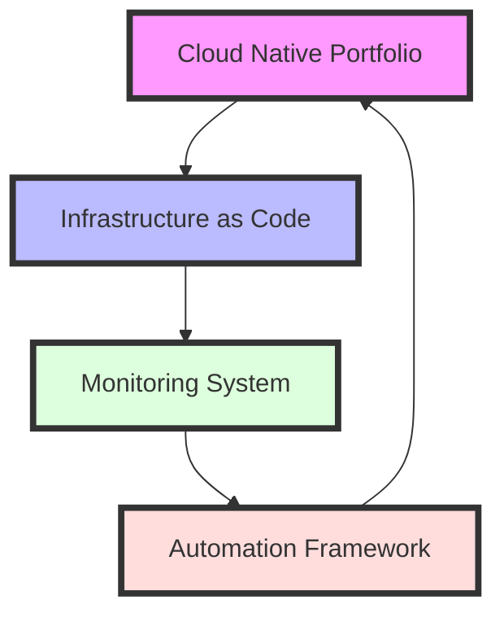

>[!info This comprehensive guide introduces a systems-based approach to DevOps career development, integrating technical mastery with cultural understanding. Through the lens of cognitive scaffolding, we explore how to build a resilient and adaptive career framework.]

## The Systems Nature of DevOps Evolution

In the rapidly evolving landscape of technology operations, DevOps represents more than a career path—it embodies a *complex adaptive system* where technical expertise interweaves with cultural transformation. This guide presents a **cognitive scaffolding** approach to career development, allowing you to navigate this complexity with purpose and clarity.

> **Systems Thinking in Career Development**: The practice of understanding career growth as an interconnected network of technical skills, cultural competencies, and feedback loops that collectively drive professional evolution.

## 1. Technical Mastery Through Systemic Integration

### The Infrastructure Knowledge Web

Modern infrastructure expertise forms a web of interconnected competencies. Here's how they relate systematically:

| Core Competency | Systemic Role | Integration Points | Growth Indicators |
|-----------------|---------------|-------------------|-------------------|
| **Cloud Architecture** | Foundation layer | Connects with IaC, security, and scalability | Production architecture designs |
| **Infrastructure as Code** | Automation enabler | Links deployment, testing, and governance | Maintainable infrastructure codebase |
| **Containerization** | Standardization layer | Bridges development and operations | Scalable container strategies |

### Automation as a Force Multiplier

The principle of automation in DevOps exemplifies *systemic leverage*—points where small inputs create large outputs:

```python
# Strategic automation example: Infrastructure health monitoring
class InfrastructureMonitor:
    def __init__(self, systems_map):
        self.systems = systems_map
        self.health_metrics = {}
        
    def analyze_system_health(self):
        """Holistic system health analysis"""
        for system, components in self.systems.items():
            self.health_metrics[system] = {
                'reliability': self._calculate_reliability(components),
                'performance': self._measure_performance(components),
                'scalability': self._assess_scalability(components)
            }
```

## 2. Cultural Evolution Framework

### The DevOps Mindset Matrix

Understanding the cultural dimensions of DevOps requires a structured yet flexible framework:

1. **Ownership Philosophy**
   - *Systems perspective*: Understanding how your actions affect the whole
   - *Proactive monitoring*: Anticipating system needs
   - *Continuous improvement*: Creating positive feedback loops

2. **Collaborative Intelligence**
   - *Cross-functional communication*: Bridging technical and business domains
   - *Knowledge sharing patterns*: Creating information flow systems
   - *Community contribution*: Expanding system boundaries

## 3. Learning Laboratory: Project Portfolio

Create a personal learning laboratory through strategically chosen projects that form a *coherent system of practice*:

### Foundational Projects Ecosystem



### Project Architecture Examples

```yaml
# Strategic project structure
Portfolio:
  infrastructure:
    - terraform_modules:
        - networking
        - compute
        - security
    - monitoring:
        - prometheus
        - grafana
        - alerting
    - automation:
        - ci_pipelines
        - deployment_scripts
        - testing_framework
```

## 4. Systemic Progress Measurement

### Creating Feedback Loops

Establish measurement systems that capture both quantitative and qualitative growth:

| Dimension | Metrics | Feedback Loop Type | Integration Points |
|-----------|---------|-------------------|-------------------|
| Technical Mastery | Project completion rate | Direct feedback | Skills application |
| Cultural Growth | Peer assessments | Delayed feedback | Team dynamics |
| System Understanding | Architecture reviews | Complex feedback | Design patterns |

## 5. Advanced Integration Patterns

For senior practitioners, consider these advanced patterns of systems integration:

1. **Meta-Learning Frameworks**
   - Pattern recognition across domains
   - Adaptive learning strategies
   - Knowledge synthesis techniques

2. **Career Ecosystem Design**
   - Strategic skill positioning
   - Opportunity network building
   - Value stream optimization

>[!tip Remember that mastery in DevOps is not linear but *emergent*—arising from the complex interactions between technical skills, cultural understanding, and systems thinking. Focus on building robust feedback loops and maintaining adaptability in your learning journey.]

### Resources for Deeper Understanding

1. **Technical Foundations**
   - "Infrastructure as Code" by Kief Morris
   - Google's SRE Books
   - The Phoenix Project

2. **Systems Thinking**
   - "Thinking in Systems" by Donella Meadows
   - "The Fifth Discipline" by Peter Senge

3. **Cultural Evolution**
   - DevOps Handbook
   - Accelerate by Nicole Forsgren

This framework represents a living system—adapt it based on your context, goals, and the emerging patterns in technology and culture.